# Document Capture — Workflow Sequence (current state)

> Sequence of the **as-implemented** `Document Capture` cascade on `russ/migrateToV16`.
> Source of truth: `erpnext/accounts/doctype/document_capture/document_capture.py`
> (`_determine_next_step` is the routing table) + `erpnext/accounts/ap_closed_loop/`.
> Last derived from code: 2026-06-05 (Lean Mode §35 — config-gated cascade reshape: gates + approval + payment SKIPPED; content-based classifier §34 + default-coding reflection §33 + company-scoped mock payment §30).
>
> **Keep `AP-CAPTURE-SEQUENCE.png` in sync.** When the cascade changes, edit the
> Mermaid block below, bump the date above, then regenerate the image with
> `<bench>/env/bin/python docs/architecture/render_sequence_diagram.py` and commit
> both files together (the CLAUDE.md "AP capture cascade / workflow" rule).

The cascade auto-advances through the steps below, **pausing at human-decision
seams** (OCR review, Coding Review when ambiguous, manual Promote, manager approval)
and **parking at Manual Review** for an employee/conflicting classification. Each hop
is enqueued on the async runner (`frappe.enqueue`, after-commit) in production; in
tests it runs synchronously. A step only fires when its precondition holds (the
`_determine_next_step` routing table), so a `Duplicate` / `Unsupported` / `Manual
Review` / `Blocked` / `Rejected` capture simply stops.

```mermaid
sequenceDiagram
    autonumber
    actor Clerk as AP Clerk
    participant Ch as Intake Channel
    participant Cap as Document Capture
    participant Q as Async Cascade (RQ)
    participant Dd as Dedupe
    participant OCR as OCR Provider
    participant Set as AP Settings
    actor Mgr as Manager
    participant PI as Purchase Invoice
    participant PE as Payment Entry (mock)

    Note over Clerk,Ch: Intake — manual upload / email-in / mobile / portal-pull(base)
    Clerk->>Ch: upload invoice file
    Ch->>Cap: create_capture_from_file()
    activate Cap
    Cap->>Cap: validate(): stream tag (R/I/Unclassified),<br/>copy File.content_hash, supported-format check
    alt unsupported format
        Cap-->>Clerk: status=Unsupported + action_required — CASCADE STOPS
    end
    Cap->>Q: after_insert → _kick_next_step()
    deactivate Cap

    Note over Q,Dd: Step 0 — pre-extraction dedupe (BEFORE any billable OCR)
    Q->>Dd: run_dedupe_for()
    Dd->>Set: get_dedupe_config()
    Dd->>Dd: exact MD5 content_hash + perceptual pHash<br/>vs last 90 days
    alt exact duplicate
        Dd-->>Clerk: status=Duplicate, duplicate_of=oldest original,<br/>action_required — CASCADE STOPS (no OCR cost)
    else near-duplicate (visual)
        Dd-->>Cap: action_required "suspected near-duplicate"<br/>(stays Pending Review → still OCR'd)
    else clean
        Dd-->>Cap: stamp duplicate_detected_at
    end

    Note over Q,OCR: Step 1 — OCR extraction (+ per-field confidence & line items, spec 04)
    Q->>OCR: run_extraction()
    OCR->>Set: get_ocr_config() (provider / model / thresholds)
    OCR-->>Cap: proposed_* + line_items + field_confidences (per-field scores),<br/>subtotal/tax, status=Proposed
    alt Step 1a — auto_confirm_enabled AND all mandatory fields confident AND no open flag (spec 04/09, T-015)
        Q->>Cap: auto_confirm_extracted_fields_for() — NO human, NO AP Review Event
        Cap->>Cap: proposed_* → final_*, ocr_status=Confirmed (auto)
    else low confidence / open flag / opt-out (default OFF)
        Note over Cap,Clerk: ⏸ PAUSE — human OCR review
        Note over Clerk,Cap: spec 10 — at any review pause a clerk may reject_capture (→ Rejected,<br/>terminal-quiet, logged) or reopen_capture (→ restore prior stage).<br/>Every review action emits one AP Review Event (root-cause tagged).
        Clerk->>Cap: confirm_extracted_fields() (+ corrections)
        Cap->>Cap: proposed_* → final_*, ocr_status=Confirmed
    end
    Cap->>Q: _kick_next_step()

    Note over Q,Cap: Step 1b — document-type classification (spec 07 + content classifier §34)
    Q->>Cap: classify_document_type()
    Cap->>Cap: decide in order: clerk override → card/PAID marker → employee group →<br/>CONTENT CLASSIFIER (rule scorer / LLM, when enabled) → default Unpaid Bill ·<br/>records classification_confidence + rationale always · stream-agreement check → document_type
    alt Employee Reimbursement, stream conflict, or unmatched-when-employee-check
        Cap-->>Clerk: status=Manual Review — CASCADE STOPS
    else Unpaid Bill or Already Paid
        Cap->>Q: _kick_next_step()
    end

    Note over Q,Cap: Step 2 — validation + gates (specs 05 / 08)
    Q->>Cap: validate_for_purchase_invoice()
    Cap->>Cap: 3-tier supplier match (alias→exact→fuzzy) + PO/PR reference (spec 05)
    alt LEAN MODE (§35) — receipt-focus, no POs
        Cap->>Cap: validation gates SKIPPED (no 3WM / anomaly / vendor bank-change)
    else full mode
        Cap->>Cap: gates (spec 08): three-way match · amount anomaly · vendor bank-change
    end
    alt unknown/ambiguous supplier · 3WM Exception · Anomalous · bank change (Stream I)
        Cap-->>Clerk: validation_status=Blocked + action_required — STOPS
    else validated
        Cap->>Cap: validation_status=Validated
    end

    alt document_type = Already Paid (Stream R) + paid-from account configured
        Note over Q,PI: Step 2a — already-paid posting (spec 07)
        Q->>PI: promote_already_paid() → Purchase Invoice is_paid=1
        PI-->>Cap: invoice + payment legs in one voucher —<br/>SKIPS approval/payment, CASCADE STOPS
    end

    opt coding configured (supplier profile · history · Stream-R catch-all, spec 06)
        Note over Q,Set: Step 2b — GL coding · cost center · tax
        Q->>Cap: apply_coding_profile()
        Cap->>Set: get_coding_settings()
        alt cost-center conflict or tax mismatch
            Cap-->>Clerk: coding_status=Ambiguous/Flagged — ⏸ Coding Review, STOPS
        end
    end
    Note over Q,Cap: unconfigured → coding hop SKIPPED (graceful degrade),<br/>coding_status stays Pending → reflected at Promote (§33)
    Note over Cap,Clerk: ⏸ PAUSE — manual Promote (needs company / item defaults)

    Clerk->>Cap: promote_to_purchase_invoice(defaults)
    opt line items present (spec 04, line-aware)
        Cap->>Cap: reconcile sum(lines) vs total
        alt mismatch > 0.01
            Cap-->>Clerk: CapturePromotionError + action_required — STOPS (no PI)
        end
    end
    Cap->>Cap: re-check vendor bank-change (spec 08)
    alt bank changed since last payment, no approved request (Stream I)
        Cap-->>Clerk: CapturePromotionError — STOPS (no PI)
    end
    Cap->>PI: create Purchase Invoice (one item per line / header fallback)
    alt coding engine never ran (unconfigured) — PI posted on ERPNext native defaults
        Cap->>Cap: _reflect_default_coding(): coding_status=Flagged ·<br/>coding_source=native-default · backfill applied_* from PI ·<br/>action_required=1 → Coding Review queue<br/>(MARK-AND-CONTINUE — cascade NOT blocked, §33)
    end
    Cap->>Q: _kick_next_step()

    alt LEAN MODE (§35) — payment external (Ramp / autopay), bank-reconciled
        Note over Q,Cap: Steps 3 & 4 SKIPPED — a posted Purchase Invoice is the terminal<br/>pre-close state ("posted, awaiting bank-feed match"). No approval / payment in ERPNext.
    else full mode
    Note over Q,Set: Step 3 — confidence-based routing (spec 09 · Already-Paid skips)
    Q->>Cap: request_approval()
    Cap->>Set: get_routing_config() (threshold + per-field confidence)
    Cap->>Cap: evaluate axes — amount · per-field confidence (spec 04) · open flags (spec 08)
    alt low-confidence field OR open validation flag
        Cap-->>Clerk: approval_status=Needs Review, routing_reason names field/flag,<br/>action_required — ⏸ review queue · emit AP Review Event (spec 10) — STOPS
        Note over Clerk,Cap: clerk clears it → reroute_after_review() re-routes
    else clean + confident
        alt total ≤ threshold
            Cap->>Cap: approval_status=Auto Approved → Ready for Payment
        else total > threshold
            Cap-->>Mgr: approval_status=Pending Manager
            Note over Cap,Mgr: ⏸ PAUSE — manager decision
            Mgr->>Cap: record_manager_decision(approve / reject)
            alt rejected
                Cap-->>Clerk: approval_status=Rejected, payment Blocked — STOPS
            end
        end
    end
    Cap->>Q: _kick_next_step()

    Note over Q,PE: Step 4 — payment (MOCK — no real banking)
    Q->>Cap: issue_mock_payment()
    Cap->>PE: create mock Payment Entry<br/>(paid_from resolved company-scoped — never a wrong-company account, §30)
    PE-->>Cap: payment_lifecycle=Closed
    Cap-->>Clerk: Closed (mock paid)
    end
```

## Notes on current state

- **Stream R vs Stream I now diverge (spec 07).** Step 1b classifies the doctype;
  an **Already Paid** (Stream R) capture posts a single `is_paid=1` Purchase Invoice
  at Step 2a (invoice + payment legs in one voucher) and **skips approval/payment**.
  An **Unpaid Bill** (Stream I) follows the full Promote → Approve → Pay path. An
  **Employee Reimbursement** / stream-conflict / unmatched-when-employee-check
  classification parks at **Manual Review**. (Bank-feed reconciliation, specs 13/14,
  is still not built.)
- **Validation gates (spec 08).** Step 2 runs three stream-aware gates — three-way
  match, amount anomaly, vendor bank-change — that block a Stream-I capture on
  failure (recorded-only on Stream R). The bank-change gate **re-asserts inside
  `promote_to_purchase_invoice`**, so a bank change made *after* a clean validation
  still blocks promotion until an approved Update-Bank-Details request lifts it.
- **Confidence-gated auto-confirm (T-015 — automation-first).** Step 1a: when
  `auto_confirm_enabled` is on AND every mandatory header field cleared its confidence
  threshold AND no validation flag is open, the cascade auto-confirms the OCR proposal
  (`auto_confirm_extracted_fields_for`) with no human and no AP Review Event — skipping
  the `Proposed` pause. Default OFF (opt-in). Any low/missing confidence or open flag
  falls back to the human review pause — escalate only the doubtful. This is the lever
  that turns "every document needs a human once" into "only the doubtful ones do."
- **AP review + instrumentation (spec 10).** Reject/reopen are explicit clerk
  actions (not auto-cascade hops): `reject_capture` sets `status = Rejected`
  (terminal-quiet, `action_required = 0`, excluded from `_determine_next_step`) with
  an `AP Capture Rejection Log` row; `reopen_capture` restores the rejected-from
  stage. Every step-9 review action — confirm/correct, manager reject, route-to-review
  — emits exactly one `AP Review Event` carrying a fixed root-cause tag, feeding the
  weekly 'Top step-9 root causes' report + auto-rate chart.
- **Confidence-based routing (spec 09).** Step 3 routes on a combined signal —
  amount vs the canonical `auto_post_amount_threshold`, every mandatory field's
  per-field confidence (spec 04), and zero open spec-08 flags. Clean+confident
  auto-advances (Auto Approved / Pending Manager by amount); a low-confidence field
  or open flag parks the capture at **Needs Review** with the failing signal named
  and a guarded `AP Review Event` (spec 10) emitted. A clerk fix + `reroute_after_review`
  sends it back through. Routing is **stream-agnostic** — Already-Paid (Stream R)
  posts at Step 2a and skips Step 3 entirely.
- **GL coding (spec 06).** Step 2b auto-codes expense/cost-center/tax when a supplier
  coding profile (or the Stream-R catch-all account) is configured; an ambiguous
  cost center or tax mismatch parks at **Coding Review**. Unconfigured sites skip
  straight to the Promote seam (graceful degrade).
- **Content-based receipt/invoice classifier (§34, spec 07).** Step 1b no longer decides
  genre from the filename/keyword alone. After the clerk-override, card/PAID-marker, and
  employee-group checks, a **content classifier** reads the document text: Phase 1 is a
  deterministic **rule scorer** (`_score_document_content`), Phase 2 an optional **LLM**
  (`_classify_text_anthropic`) selected by `content_classifier_provider`, dispatched by
  `classify_document_content` which **degrades to the rule scorer on any LLM failure**. It
  is **default-OFF** (gated by `enable_content_classifier`): the verdict only *decides* the
  document type when opted in, but the `classification_confidence` + `classification_rationale`
  are recorded either way. Clerk override and the card/PAID short-circuit still take precedence.
- **Default-coding reflection (§33 — mark-and-continue).** When the coding engine
  never ran (unconfigured → skipped) and the capture is promoted, the PI posts on
  ERPNext native defaults. `promote_to_purchase_invoice` now **reflects** that via
  `_reflect_default_coding`: `coding_status=Flagged`, `coding_source=native-default`,
  the `applied_*` fields backfilled from the PI, a `coding_review_reason`, and
  `action_required=1` so it surfaces in the **Coding Review queue**. This is
  *mark-and-continue* — the cascade gates on promotion/approval status, **not**
  `coding_status`/`action_required`, so the capture keeps advancing to approval/payment
  while a human reviews the defaulted coding after the fact (vs the *park* variant,
  which would block). Genuinely-coded captures and the already-paid stream are untouched.
- **Company-scoped mock payment (§30).** `issue_mock_payment` resolves the disbursing
  `paid_from` account scoped to the PI's company (explicit override → legacy default
  only if it belongs to this company → company default bank/cash → company's single
  Bank/Cash account), so a multi-company capture never fails with *"Account … does not
  belong to Company …"*.
- **Pause / park seams** are deliberate (no silent posting): OCR review, Coding
  Review (when ambiguous), manual Promote, **Needs Review** (low confidence / open
  flag), manager approval — plus the Manual Review park for classification.
- **Payment is mock** — `issue_mock_payment` writes a Payment Entry tagged as a
  pilot mock; there is no real banking integration.
- **Dedupe perceptual branch** needs `poppler` on the worker; absent it, Step 0
  degrades to the exact-hash check only (the rest of the flow is unchanged).
- **Routing table:** the step preconditions live in `_determine_next_step`
  (`document_capture.py`); the whitelisted step functions are
  `run_dedupe_for` / `run_fake_extraction_for` / `classify_document_type_for` /
  `validate_for_purchase_invoice_for` / `promote_already_paid_for` /
  `apply_coding_profile_for_ui` / `request_approval_for` / `issue_mock_payment_for`.
