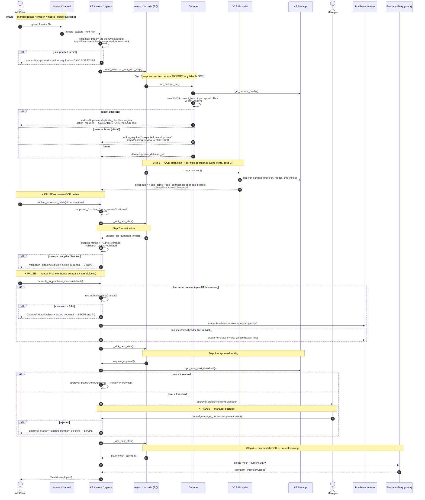

# AP Invoice Capture — Workflow Sequence (current state)

> Sequence of the **as-implemented** `AP Invoice Capture` cascade on `russ/migrateToV16`.
> Source of truth: `erpnext/accounts/doctype/ap_invoice_capture/ap_invoice_capture.py`
> (`_determine_next_step` is the routing table) + `erpnext/accounts/ap_closed_loop/`.
> Last derived from code: 2026-05-31.
>
> **Keep `AP-CAPTURE-SEQUENCE.png` in sync.** When the cascade changes, edit the
> Mermaid block below, bump the date above, then regenerate the image with
> `<bench>/env/bin/python docs/architecture/render_sequence_diagram.py` and commit
> both files together (the CLAUDE.md "AP capture cascade / workflow" rule).

The cascade auto-advances through the steps below, **pausing at three human-decision
seams** (OCR review, manual Promote, manager approval). Each hop is enqueued on the
async runner (`frappe.enqueue`, after-commit) in production; in tests it runs
synchronously. A step only fires when its precondition holds, so a `Duplicate` /
`Unsupported` / `Rejected` capture simply stops.

## Notes on current state

- **Stream R vs Stream I:** intake tags a provisional stream (spec 02), but the
  cascade above is the **single linear path** — the divergent Stream-R posting
  (PI `is_paid` / clearing) and bank-feed reconciliation (specs 07 / 13) are
  **not yet built**, so today every capture follows the Promote → Approve → Pay
  path regardless of stream.
- **Three pause seams** are deliberate (no silent posting): OCR review, manual
  Promote, manager approval.
- **Payment is mock** — `issue_mock_payment` writes a Payment Entry tagged as a
  pilot mock; there is no real banking integration.
- **Dedupe perceptual branch** needs `poppler` on the worker; absent it, Step 0
  degrades to the exact-hash check only (the rest of the flow is unchanged).
- **Routing table:** the step preconditions live in `_determine_next_step`
  (`ap_invoice_capture.py`); the whitelisted step functions are
  `run_dedupe_for` / `run_fake_extraction_for` / `validate_for_purchase_invoice_for`
  / `request_approval_for` / `issue_mock_payment_for`.
